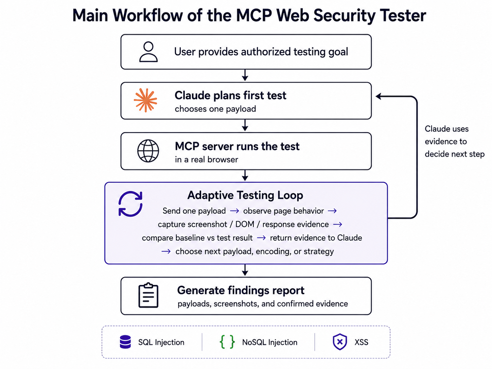

# 🔐 MCP Web Security Tester

Python MCP server that connects Claude Desktop with a Playwright browser for authorized web security testing.

The project lets an AI open web pages, interact with forms, test one payload at a time, and collect evidence by comparing the normal page behavior with the test result.

Instead of running a fixed list of checks and returning a final report, the LLM stays inside the testing loop.

Claude sends one test at a time, the MCP server executes it in a real browser, the response is compared against a baseline, and the collected evidence is returned to Claude. Claude can then analyze the result and decide the next test instead of blindly continuing through a predefined payload list.

The project is mainly focused on:

* SQL injection testing
* NoSQL injection testing
* XSS testing
* Browser-based evidence collection
* Baseline vs test response comparison
* Iterative LLM-guided testing

The design can be extended later with more guided testing strategies, additional vulnerability categories, and professional report generation.

## 🎥 Demo

The demo shows Claude Desktop using the MCP server to interact with the OWASP Juice Shop through a Playwright-controlled Chromium browser.

Claude tests one payload at a time, receives browser and DOM evidence, analyzes the result, and adapts the next testing step.

[▶️ Watch the demo](https://youtu.be/JEcNxH_9UKo)

The demonstrated workflow confirms a DOM-based XSS finding in the OWASP Juice Shop search functionality using browser and DOM evidence.

## 🔄 Main Workflow



The adaptive testing loop follows this process:

1. Claude selects a target element and generates one payload.
2. The MCP server records the normal page behavior as a baseline.
3. Playwright submits the payload through the browser.
4. The server collects browser, response, URL, and DOM evidence.
5. The evidence analyzer compares the test result with the baseline.
6. Claude receives the evidence and decides whether to stop, confirm the finding, or try a different strategy.

## 💻 Tech Stack

* Python
* Model Context Protocol SDK
* FastMCP
* Playwright
* Chromium

## ⚙️ Installation

Clone the repository:

```bash
git clone https://github.com/YOUR_USERNAME/YOUR_REPO_NAME.git
cd YOUR_REPO_NAME
```

Create a virtual environment:

```bash
python -m venv .venv
```

Activate the virtual environment on Windows PowerShell:

```bash
.\.venv\Scripts\Activate.ps1
```

Install the dependencies:

```bash
pip install "mcp[cli]" playwright
```

Install the Playwright Chromium browser:

```bash
python -m playwright install chromium
```

Run the server manually to verify the installation:

```bash
python server.py
```

## 🤖 Claude Desktop Configuration

Add the MCP server to your Claude Desktop configuration:

```json
{
  "mcpServers": {
    "mcp-security": {
      "command": "C:\\Users\\PC\\OneDrive - ESPRIT\\Bureau\\mcp-python\\.venv\\Scripts\\python.exe",
      "args": [
        "C:\\Users\\PC\\OneDrive - ESPRIT\\Bureau\\mcp-python\\MCP\\server.py"
      ],
      "env": {
        "PYTHONUNBUFFERED": "1"
      }
    }
  }
}
```

Replace the `command` and `args` paths with the locations of the virtual-environment Python executable and `server.py` on your machine.

Restart Claude Desktop after saving the configuration.

## ⚠️ Responsible Use

Only use this project against:

* Applications you own
* Systems for which you have explicit authorization
* Local security labs
* Intentionally vulnerable platforms such as OWASP Juice Shop

Do not use it against third-party systems without permission.
